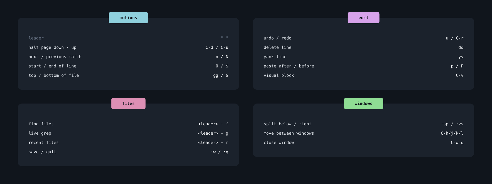
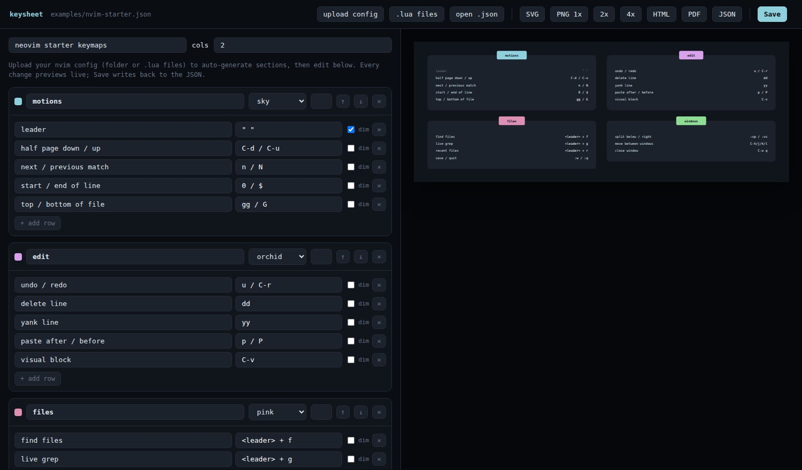

# keysheet
Generate pretty keymap cheatsheets from a small JSON file — or auto-extract them from your Neovim config — edit them live in the browser, and export to SVG, PNG, HTML or PDF.



---

WARNING: this project is 100% vibe coded. I wanted to see some fable 5 capabilities as I am (luckily) not allowed to use AI for my daily sw dev work.\
I had this idea when I refactored my [neovim configuration](https://github.com/D4ykoo/nvim.daykoo/tree/main). In commit [5ba7b6a](https://github.com/D4ykoo/nvim.daykoo/tree/5ba7b6a2579a8d9ab783335c6d574473b416009e) you can see in the README the manually created keymap cheatsheet using [Penpot](https://github.com/penpot/penpot).\
This was time consuming, but pretty and is quite nicer to look at compared to whichkey. Since I had nothing done with AI yet, I considered parsing a configuration with various ways of describing motions in lua compared with a nice editor and visualization is a nice little task for fable. And here we are! hope you enjoy it.\
DISCLAIMER: I do not want to actively maintain such an AI slop - but feel free to create (sloppy) MRs.

---



Zero dependencies, runs on Bun (Node ≥ 22 also works,
since only `node:*` APIs are used).

```
bun run serve            # live preview at http://localhost:4711
bun run build            # → out/keysheet.svg + out/keysheet.html
```

## Examples

`keymaps.json` is a tiny starter you can overwrite. `examples/` has a few more
to render or crib from:

```
bun run src/cli.ts build examples/nvim-starter.json -o out
bun run src/cli.ts build examples/tmux.json         -o out
```

`tmux.json` also shows two things: a per-sheet `theme` override, and that the
tool isn't Neovim-specific — any list of "description → keys" works.

## Docker

The container runs the editor server. Zero dependencies and Bun runs the `.ts`
sources directly, so the image is just a copy-and-run (no build step).

```
docker build -t keysheet .
docker run --rm -p 4711:4711 keysheet          # open http://localhost:4711
```

`PORT` and `HOST` are read from the environment (the image sets
`HOST=0.0.0.0` so the port is reachable). "Save" writes to `keymaps.json`
inside the container, which is ephemeral — mount a volume to persist edits:

```
docker run --rm -p 4711:4711 -v "$PWD/keymaps.json:/app/keymaps.json" keysheet
```

### Compose

A `docker-compose.yml` is included — it builds the image, maps the port, sets
`PORT`/`HOST`, and mounts `keymaps.json` so Save persists:

```
docker compose up --build       # → http://localhost:4711
docker compose up -d            # detached
```

To run the published image instead of building locally, comment out `build`
and uncomment the `image: ghcr.io/d4ykoo/keysheet.nvim:latest` line.


## Workflow (editor)

```
bun run serve            # opens the editor at http://localhost:4711
```

The editor is the whole loop in one page:

1. **Load your config** — drag your `nvim` folder straight onto the page
   (easiest), or use the **config folder** button; **.lua files** picks
   individual files instead. Every `.lua` file is scanned recursively and
   turned into one section per file, colored round-robin from the palette.
   Descriptions are inferred from each map's right-hand side where possible
   (`harpoon:list():select(1)` → "nav file 1", `<cmd>NvimTreeToggle<cr>` →
   "NvimTreeToggle", `vim.lsp.buf.rename` → "rename symbol"); the rest come
   through as `TODO: describe`.
   Already have a sheet? **open .json** loads a `keymaps.json` (e.g. one you
   exported earlier) straight into the editor — no extraction, since JSON is
   already the sheet format. The **config folder** / **.lua files** buttons are
   only for extracting from a Lua config; drop or open a `.json` and it's
   loaded as a sheet instead.
2. **Edit** — rename sections, change pill colors, pin sections to a column,
   reorder sections, add/remove/reword rows, mark meta rows as dimmed. The
   preview on the right updates live on every keystroke.
3. **Export** — **SVG**, **PNG 1x/2x/4x**, **HTML**, **PDF** (opens the HTML
   export and triggers the print dialog), **JSON**.
4. **Save** — writes the current model back to the JSON file you passed to
   `serve` (default `keymaps.json`), so edits persist across sessions. Start
   `serve` with no existing file and you begin from an empty sheet.

Nothing leaves your machine — the server is local and the extractor runs in
Node/Bun, not in the browser.

## Exports

| Format | How                                     | Notes                                              |
| ------ | --------------------------------------- | -------------------------------------------------- |
| SVG    | `build --format svg` or preview button  | Deterministic, resolution-independent              |
| HTML   | `build --format html` or preview button | Standalone file, selectable text, responsive       |
| PNG    | Preview buttons (1x / 2x / 4x)          | Rasterized in your browser with your local fonts   |
| PDF    | HTML export → browser print dialog      | Print stylesheet included                          |

PNG lives in the browser on purpose: the SVG references `JetBrains Mono` with
fallbacks, and your machine is where those fonts actually exist. A headless
CLI rasterizer would either need a font bundle or silently substitute glyphs.

## Seeding from an existing Neovim config

Dragging your `nvim` folder onto the editor (or the **config folder** button)
is the easy path. For scripting there's also a headless CLI extractor that
writes the same draft JSON:

```
bun run src/cli.ts extract ~/.config/nvim -o draft.json
```

Both use the same scanner: a best-effort pass over `vim.keymap.set(...)`,
kickstart-style `map(...)` helpers, and lazy.nvim `keys = { ... }` specs,
grouped one section per file, with descriptions inferred from the rhs. It's a
curation starting point, not a Lua parser — maps built dynamically (loops,
computed lhs) or via other helpers may be missed, and macro-style rhs values
come through as `TODO: describe` for you to fill in.

## Data format

```jsonc
{
	"title": "example keymaps",
	"columns": 2,
	"sections": [
		{
			"name": "files",            // pill label
			"color": "pink",            // palette name or "#rrggbb"
			"column": 1,                // optional: pin to a column (1-based)
			"maps": [
				{ "desc": "find files", "keys": "<leader> + f" },
				{ "desc": "leader", "keys": "\" \"", "muted": true }
			]
		}
	]
}
```

See `keymaps.json` in the repo for a small runnable example — replace it with
your own, or generate one by uploading your config in the editor.

Sections without `column` are placed masonry-style into the currently
shortest column, in source order. Palette names: `sky pink orchid chartreuse
mint forest violet amber coral steel` (see `src/theme.ts`). Theme tokens
(background, card, text colors, font, size) can be overridden per sheet via a
top-level `"theme": { ... }` object.

Descriptions that would collide with their keys are truncated with `…` and
reported as a warning (CLI stderr / toast in the editor).

## Layout constants

Card width, paddings, row height, pill size and radii live in the `LAYOUT`
object in `src/layout.ts` — tweak there for denser rows or wider cards. The
renderer in `src/svg.ts` only emits markup; it reads geometry from `LAYOUT`,
so a change there flows to every export.

## Project layout

```
src/
  types.ts       data model (Sheet / Section / KeymapEntry / theme)
  theme.ts       palette + default theme + color resolution
  layout.ts      geometry constants + masonry placement
  svg.ts         Sheet -> SVG string (the one renderer)
  html.ts        Sheet -> standalone HTML export
  lua-scan.ts    low-level Lua lexing primitives (no keymap knowledge)
  infer.ts       description inference from a map's right-hand side
  extract.ts     config -> draft Sheet (orchestrates lua-scan + infer)
  build.ts       render a Sheet to files in a directory
  serve.ts       editor HTTP server (route table + JSON API)
  assets.ts      loads the client/ files from disk
  cli.ts         argument parsing + command dispatch
client/
  editor.html    editor shell
  editor.css     editor styles
  editor.js      editor logic (state, live render, upload, drag-drop, exports)
test/
  *.test.ts      node:test suites for the modules above
examples/        ready-to-render sample sheets
docs/assets/     screenshots used in this README
Dockerfile       editor server image (bun-alpine, non-root)
docker-compose.yml  build/run the editor with a persisted keymaps.json
.github/workflows/docker.yml   build + push to GHCR on tags/main
```

The dependency flow is one-directional: `cli` → `build`/`serve` →
`svg`/`html`/`extract` → `layout`/`theme` and `lua-scan`/`infer`. Nothing
lower reaches back up, so each module can be read and tested on its own.

## Tests

```
npm test        # or: node --test test/*.test.ts
```

The suites cover the parts most likely to regress: the Lua scanner, the
description-inference heuristics, the extractor end-to-end on small snippets,
and the layout/render (deterministic output, masonry placement, truncation).
Run them after touching `lua-scan`, `infer`, `extract`, `layout`, or `svg`.
